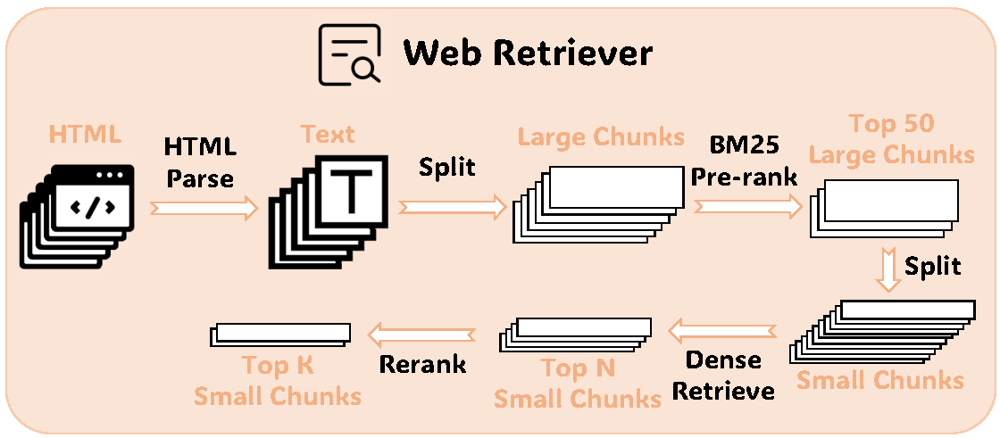

# Meta KDD Cup '24 [CRAG: Comprehensive RAG Benchmark](https://ustc-rag-x.github.io/) 🥈 Solution for Task 2&3

This repository is the 🥈 solution of **Meta KDD Cup '24 CRAG: Comphrensive RAG Benchmark** for task 2&3!

---
>
> 🙋 Please let us know if you find out a mistake or have any suggestions!
> 
> 🌟 If you find this resource helpful, please consider to star this repository and cite our research:

```
@article{ouyang2024revisiting,
  title={Revisiting the Solution of Meta KDD Cup 2024: CRAG},
  author={Ouyang, Jie and Luo, Yucong and Cheng, Mingyue and Wang, Daoyu and Yu, Shuo and Liu, Qi and Chen, Enhong},
  journal={arXiv preprint arXiv:2409.15337},
  year={2024}
}

```

## 📖 Competition Overview

A RAG QA system takes a question **Q** as input and outputs an answer **A**; the answer is generated by LLMs according to information retrieved from external sources, or directly from the knowledge internalized in the model. The answer should provide useful information to answer the question, without adding any hallucination or harmful content such as profanity.

### 🏹 CHALLENGE TASKS

This challenge comprises of three tasks designed to improve question-answering (QA) systems.

**TASK #1**: WEB-BASED RETRIEVAL SUMMARIZATION Participants receive **5 web pages** per question, potentially containing relevant information. The objective is to measure the systems' capability to identify and condense this information into accurate answers.

**TASK #2**: KNOWLEDGE GRAPH AND WEB AUGMENTATION This task introduces **mock APIs** to access information from underlying mock Knowledge Graphs (KGs), with structured data possibly related to the questions. Participants use mock APIs, inputting parameters derived from the questions, to retrieve relevant data for answer formulation. The evaluation focuses on the systems' ability to query structured data and integrate information from various sources into comprehensive answers.

**TASK #3**: END-TO-END RAG The third task increases complexity by providing **50 web pages** and **mock API** access for each question, encountering both relevant information and noises. It assesses the systems' skill in selecting the most important data from a larger set, reflecting the challenges of real-world information retrieval and integration.

Each task builds upon the previous, steering participants toward developing sophisticated end-to-end RAG systems. This challenge showcases the potential of RAG technology in navigating and making sense of extensive information repositories, setting the stage for future AI research and development breakthroughs.


### 📊 Dataset

Please find more details about the dataset in  [`dataset_description-v3.md`](./example_data/dataset_description-v3.md) 


## 🏁 Our Solution


Our approach, akin to most Retrieval-Augmented Generation (RAG) systems, comprises two primary phases: retrieval and generation. In both phases, we implement routing mechanisms to address diverse query types.

### Router

We designed two specialized routers: the **Domain Router** and the **Dynamism Router**.

We trained **Sentence Classifiers** as routers for Domain and Dynamism based on **Llama3-8B-Instruct**.

Model Weights locate at `models/router`.

### Retriever

#### Web Pages



1. **HTML Parsing**: Convert structured HTML into natural language text with [`newspaper3k`](https://github.com/codelucas/newspaper).
2. **Pre-ranking** (Task 3 only): Segment text from Web Pages into chunks of **1024** tokens. Use **BM25** to select the top **50** relevant text blocks.
3. **Ranking**: Segment text blocks into **256**-token chunks, transform them into embeddings using the `bge-m3` model, and select the top 10 relevant chunks based on cosine similarity.
4. **Re-ranking**: Use `bge-m3-v2-reranker` to re-rank the Top **10** chunks and select the Top **5** segments.

For more detail, refers to `models/retrieve/retriever.py`.

#### Mock APIs


1. **Named Entity Recognition (NER)**: Use Llama3-70B to classify named entities in questions into predefined categories specific to each domain.
2. **Entity Match**: Match extracted entities with API input parameters (e.g., converting company names to ticker symbols for finance APIs).
3. **Time Information Extraction**: Extract temporal information from user inputs and compute relative time based on query time.
4. **API Select**: Use manually designed rules to select relevant APIs for a given question.
5. **Json to Markdown**: Convert JSON output from APIs into Markdown format for better processing by LLMs.

For more detail, refers to `models/mock_api`.

### Generation

#### Data Source Integration

For different domains, we select specific data sources and integrate them to construct the final reference:

- **Open**: Web Page Only
- **Movie**: Both Web Page and Mock APIs
- **Music**: Both Web Page and Mock APIs
- **Sports**: Mock APIs Only
- **Finance**: Mock APIs Only

#### Adaptive Few-Shot CoT Prompt

```python
"""For the given question and multiple references from Mock API, think step by step, then provide the final answer.
Current date: {query_time}

Note: 
- For your final answer, please use as few words as possible. 
- The user's question may contain factual errors, in which case you MUST reply `invalid question` Here are some examples of invalid questions:
    - `what's the latest score update for OKC's game today?` (There is no game for OKC today)
    - `how many times has curry won the nba dunk contest?` (Steph Curry has never participated in the NBA dunk contest)
- If you don't know the answer, you MUST respond with `I don't know`
- If the references do not contain the necessary information to answer the question, respond with `I don't know`
- Using only the refernces below and not prior knowledge, if there is no reference, respond with `I don't know`
- Your output format needs to meet the requirements: First, start with `## Thought\n` and then output the thought process regarding the user's question. After you finish thinking, you MUST reply with the final answer on the last line, starting with `## Final Answer\n` and using as few words as possible.

### Question
{query}

### References
{references}
"""
```


## Get Started

### Install Dependencies!
```bash
pip install -r requirements.txt
```

### Download Models

`meta-llama/Meta-Llama-3-8B-Instruct`:

+ https://huggingface.co/meta-llama/Meta-Llama-3-8B-Instruct
+ https://www.modelscope.cn/models/LLM-Research/Meta-Llama-3-8B-Instruct

`BAAI/bge-m3`:

+ https://huggingface.co/BAAI/bge-m3
+ https://www.modelscope.cn/models/Xorbits/bge-m3

`BAAI/bge-reranker-v2-m3`:

+ https://huggingface.co/BAAI/bge-reranker-v2-m3
+ https://www.modelscope.cn/models/AI-ModelScope/bge-reranker-v2-m3

### Run LLM

+ Use API server(such as openai)

  + open [`main.py`](main.py)
  + setup your `api_key`and `base_url`
  + choose your `model_name`(default: gpt-4o)

+ Run LLM locally with vLLM server

  + download your llm(such as Llama3-70B)

  + start your server using python

    ```bash
    python -m vllm.entrypoints.openai.api_server \
      --model ./meta-llama/Meta-Llama-3-8B-Instruct \
      --served-model-name Llama3-8B \
      --trust-remote-code
    ```

    refer to https://docs.vllm.ai/en/stable/serving/openai_compatible_server.html for more details

  + open [`main.py`](main.py)

  + choose you `model_name`, such as `Llama3-8B`

  + add parameter `stop` to function `load_model`

    ```python
    load_model(model_name=model_name, api_key=api_key, base_url=base_url, temperature=0, stop=["<|eot_id|>"])
    ```

+ Run LLM locally with Ollama

  + install ollama

    ```bash
    curl -fsSL https://ollama.com/install.sh | sh
    ```

  + pull llm(such as llama3)

    ```
    ollama pull llama3
    ```

  + open [`main.py`](main.py)

  + choose you `model_name`, such as `llama3`

  + use `load_model_ollama`

### Setup Retriever

+ **Retriever_Milvus**: Build a vector store with milvus(recommend)

  + use milvus lite

    + run `models/retrieve/build_vector_db.py` for task 1&2
    + run `models/retrieve/build_vector_db_task3.py` for task 3

  + use milvus server

    + Install Milvus in Docker

      Milvus provides an installation script to install it as a docker container. The script is available in the [Milvus repository](https://raw.githubusercontent.com/milvus-io/milvus/master/scripts/standalone_embed.sh). To install Milvus in Docker, just run

      ```shell
      # Download the installation script
      $ curl -sfL https://raw.githubusercontent.com/milvus-io/milvus/master/scripts/standalone_embed.sh -o standalone_embed.sh
      
      # Start the Docker container
      $ bash standalone_embed.sh start
      ```

    + use `uri = "http://localhost:19530"`
      + run `models/retrieve/build_vector_db.py` for task 1&2
      + run `models/retrieve/build_vector_db_task3.py` for task 3

+ **Retriever**: Calculate embedding when evaluate

  + no change

### Predict

run `main.py`

### Evaluate

run `evaluation.py`

